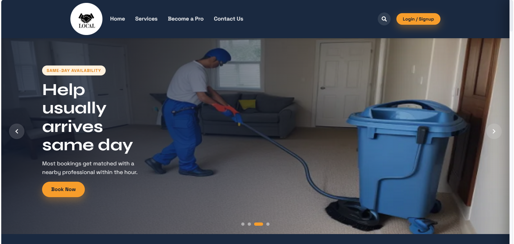
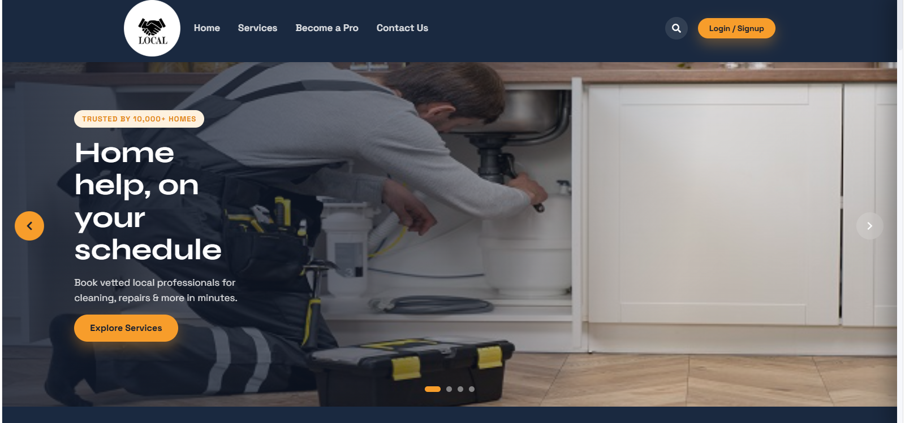
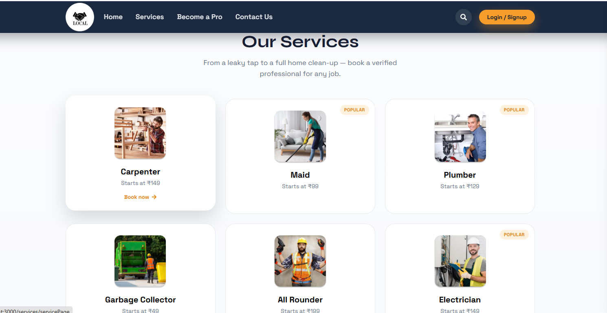
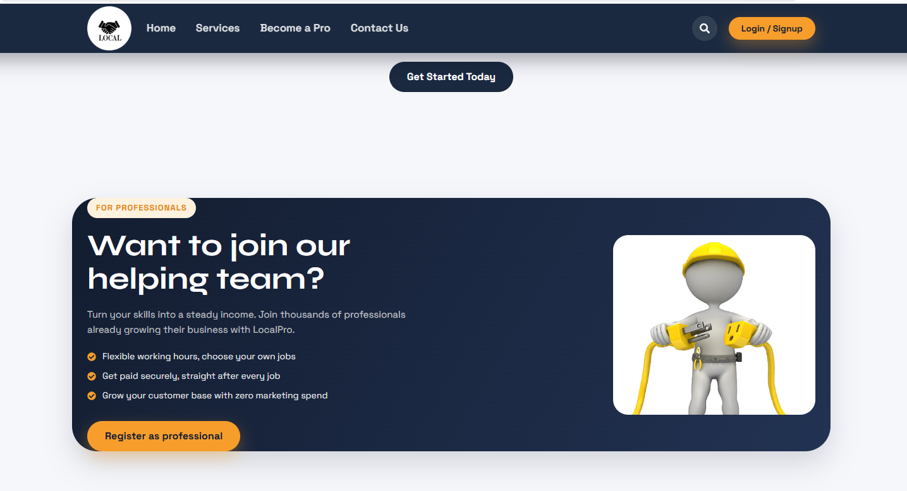
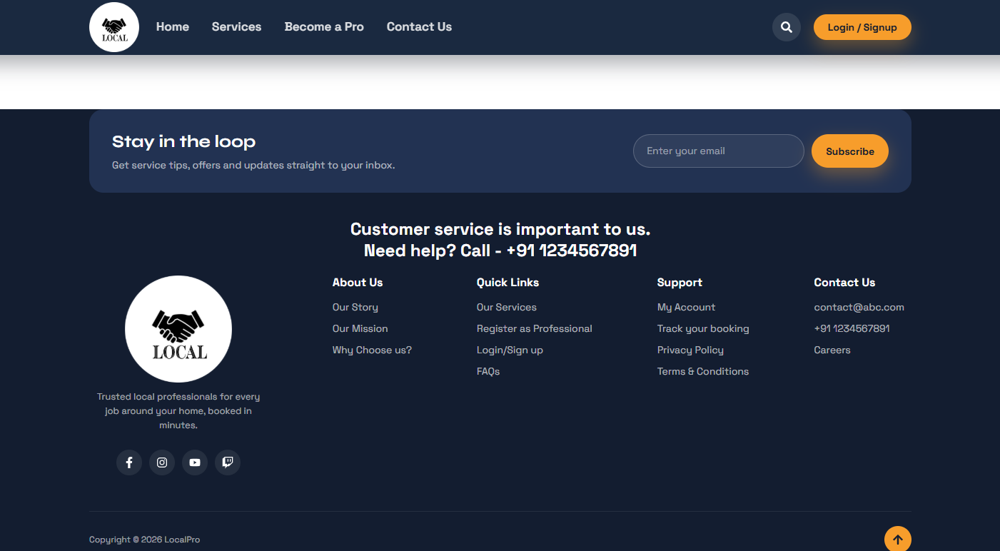

# LocalPro

A local home-services marketplace (MERN stack) — book vetted professionals for cleaning, plumbing, electrical work, carpentry and more.

- **Frontend:** React 18, React Router 6, Redux Toolkit, Mapbox GL — `/client`
- **Backend:** Node.js, Express, MongoDB (Mongoose), JWT auth, Stripe, Cloudinary — `/server`

---

---

---
---

---
---

---
---

---
---

---

## Getting Started

### Prerequisites
- Node.js 18+ and npm
- A MongoDB connection string (local or Atlas)

### 1. Backend

```bash
cd server
npm install
```

Open `server/db/connection.js` and set `LOCAL_URI` to your MongoDB connection string (it currently ships blank).

You'll also want to check `server/index.js` and the `server/controller` files for any other keys expected via environment variables (Stripe, Cloudinary, JWT secret, email/OTP credentials) and create a `.env` file accordingly.

```bash
npm run dev   # starts with nodemon on http://localhost:5000
```

### 2. Frontend

```bash
cd client
npm install
npm run start   # starts on http://localhost:3000
```

To build for production:

```bash
npm run build
```

---

## Project Structure

```
localpro/
├── client/                  # React app
│   ├── src/
│   │   ├── components/      # Homepage, AvailableServices, Register, Payment, etc.
│   │   ├── styles/theme.css # shared design system (colors, buttons, cards, layout)
│   │   ├── hooks/           # shared hooks (useScrollReveal, etc.)
│   │   └── utils/           # cookies, geolocation, static data
│   └── public/
└── server/                  # Express API
    ├── controller/
    ├── models/
    ├── routes/
    └── db/
```

---

## Recent Redesign

The Homepage and Available Services / booking entry flow were redesigned, along with the shared Navbar/Footer, so the whole product feels like one cohesive experience. Everything else (Register, Handyman Dashboard, Payment, backend) is untouched and works as before.

### Shared design system
- `client/src/styles/theme.css` — CSS custom properties for color, type, radius, shadow and motion, plus reusable classes (`.lp-btn`, `.lp-card`, `.lp-chip`, `.lp-badge`, `.lp-section`, etc.) so new sections don't reinvent styling.
- `client/src/hooks/useScrollReveal.js` — shared IntersectionObserver hook for fade-up section reveals.

### Navbar & Footer
- Navbar: sticky with a scroll-shadow/shrink effect, animated underline nav links, a slide-in mobile drawer with overlay, a profile dropdown for logged-in users (Profile / My Bookings / Logout), and a search shortcut.
- Footer: working newsletter signup (validates email, shows a toast), real social icons, a back-to-top button, and Quick Links wired to their actual routes.

### Homepage
- **Hero carousel** — replaced the old Bootstrap-JS/jQuery-dependent carousel with a dependency-free React carousel: real autoplay, pause-on-hover, swipe support, keyboard arrows, and per-slide headline/CTA copy.
- **Trust stats bar** *(new)* — animated count-up stats (customers, professionals, cities, rating) triggered on scroll into view.
- **Our Services** — card grid with "Popular" badges, starting prices, and hover-reveal CTAs.
- **How It Works** *(new)* — 3-step explainer (Search → Book → Relax).
- **Join Our Team** — redesigned banner with a benefits list for professionals.
- **Testimonials** *(new)* — a small functional review carousel with star ratings and avatar initials.
- **FAQ accordion** *(new)* — expandable Q&A, linked from the footer.

### Available Services page
- Rebuilt from a fixed-height sidebar list into a proper marketplace layout: hero search header, category filter chips, a sort dropdown (Recommended / Price / Rating / Duration), a responsive card grid, and an empty state with a "Clear filters" action.
- Extended `client/src/utils/AvailableServices.js` with category, rating, review count and starting price so filtering/sorting is real, not decorative.
- Redesigned the service card to show rating, price, duration and a "Popular" badge.

### Bug fix (found while verifying the build)
`client/src/components/Register/UserProfile.jsx` imported `getUserToken` from a hardcoded local Windows path (`E:/MCA/proj/...`), which meant the project could not `npm run build` at all. Fixed to a relative import.

### Verified
`npm install && npm run build` in `/client` completes successfully with no errors. Pre-existing ESLint warnings elsewhere in the codebase are unrelated to this change and don't block the build.
